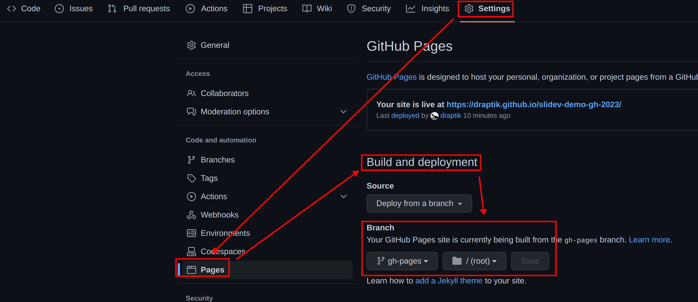
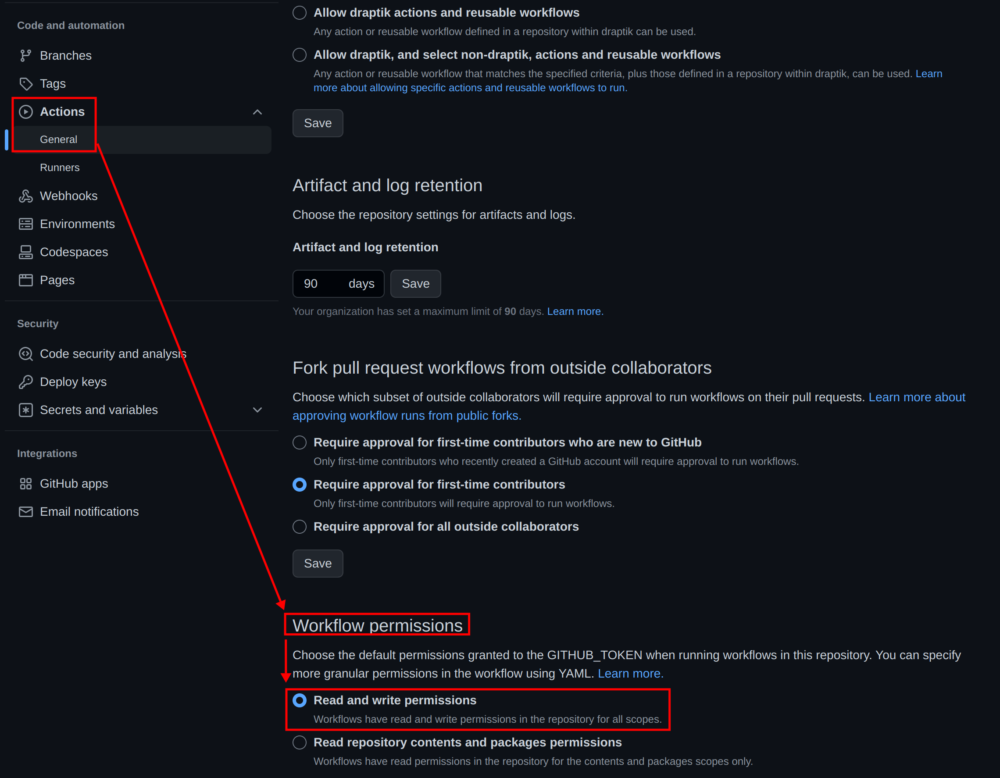

# Showcase: Publish slidev presentation from subfolder to Github Pages

- Folder [`presentation-demo`](./presentation-demo/) contains the default [Slidev](https://sli.dev/) presentation. This is our `<subfolder>`.
- File [`.github/workflows/deploy.yml`](.github/workflows/deploy.yml) contains the github actions for publishing to github pages. In
  addition to the [official documentation](https://sli.dev/guide/hosting.html#github-pages), there
  are some extra `cd <subfolder>` instructions in the `run` statements. The `build-dir` assignment is also prepended by the `<subfolder>`.

If you want to include custom static resources (images, fonts, etc): Have a look at
- the commented `deploy-custom` job in [`.github/workflows/deploy.yml`](.github/workflows/deploy.yml)
- and the project [`presentation-custom`](./presentation-custom).

## Prerequisites

Web UI of Github Repo

- Settings -> Pages -> Branch: Choose "gh-pages" branch and "/ (root)" in drop-down menus, and save.

- Ensure that GH-Actions has the required permissions: Settings -> Actions -> General -> Workflow permissions: Read and **Write** permissions

## Multiple Presentations under a single GH Pages URL

Goal: Multiple, similar slidev presentations with a dedicated URL per presentation.

Example:

- Main git branch: `main`
- git branch per conference, f.ex. `demo1`, `demo2`
- Using [GH action: GH Pages Deploy Action](https://github.com/JamesIves/github-pages-deploy-action) (see [.github/workflows/deploy.yml](.github/workflows/deploy.yml))

Result:

- [demo1 GH Pages](https://draptik.github.io/slidev-demo-gh-2023/demo1/index.html)
- [demo2 GH Pages](https://draptik.github.io/slidev-demo-gh-2023/demo2/index.html)
- TODO | only drawback: we need `index.html` at the end, otherwise there will be an URL-redirect to the main page...

## Alternative: Presentation to a different GH Pages repository URL

TODO This is an experiment

